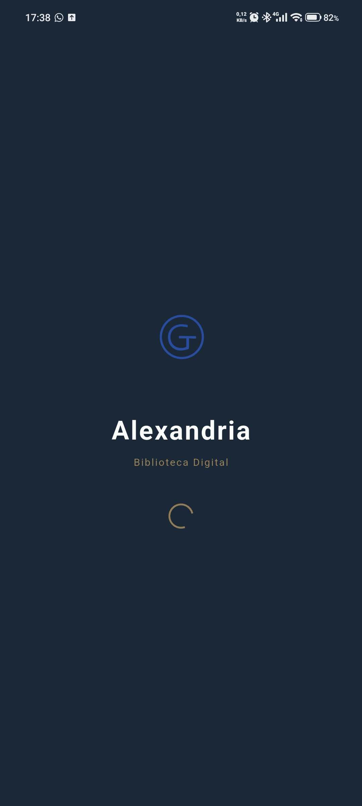
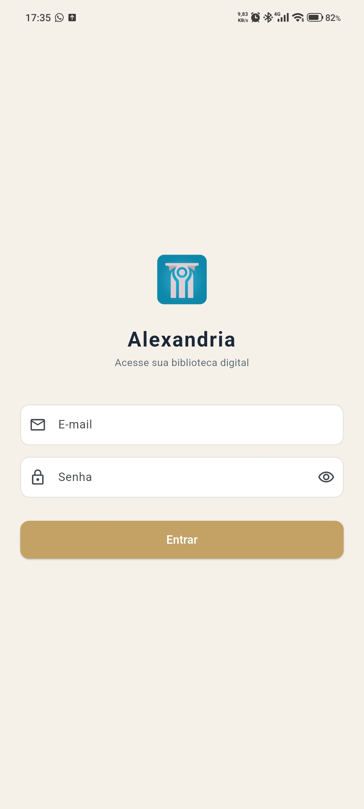
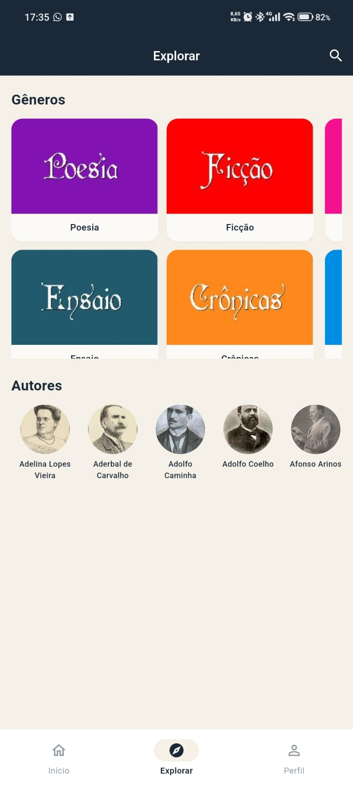
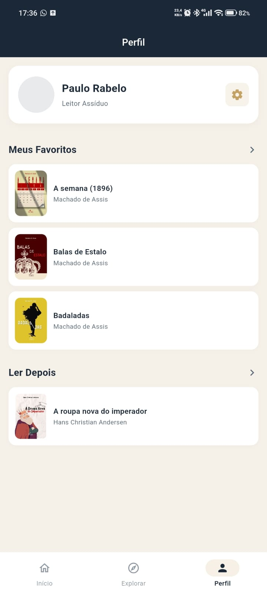
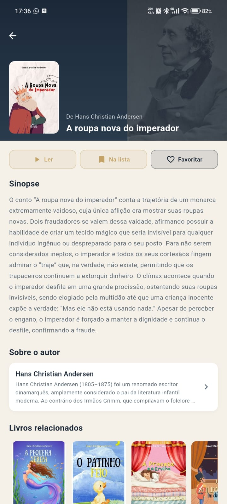
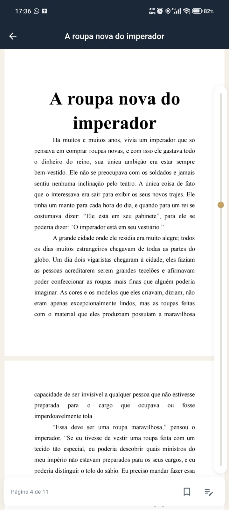
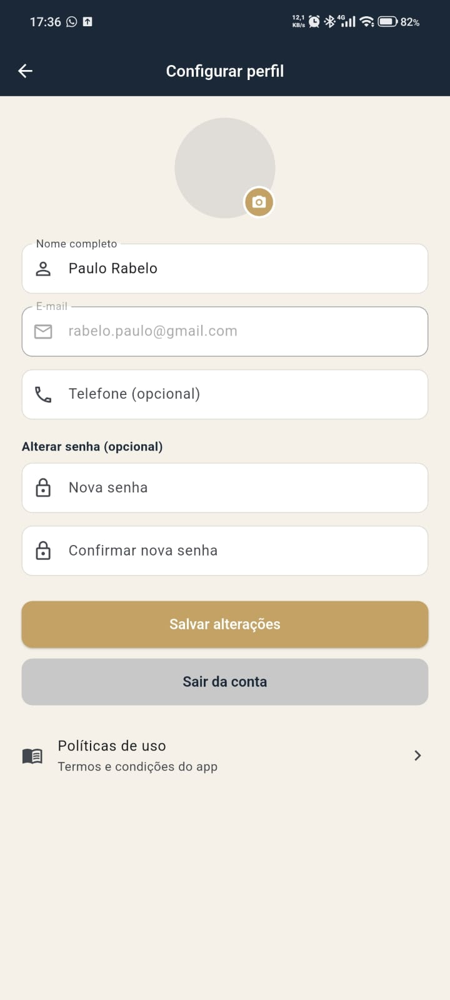

# 8.3.4 — Passo 4: Protótipo de telas (prints)

**Projeto:** Alexandria — Biblioteca Digital (Globaltec Educacional)  
**Etapa:** 8.3 — UX, telas e protótipos funcionais  
**Evidências visuais:** obrigatório — capturas do app Flutter em `entregas/evidencias/`

---

## O que este passo pede

Documentar o **protótipo navegável de alta fidelidade** (app compilado) com **capturas de tela** das telas principais, na **ordem do fluxo**, para validação rápida de UX.

> **Único entregável com prints da etapa 8.3.** As demais etapas (8.6, etc.) **referenciam** os códigos E-XXX deste arquivo — não duplicam imagens.

> **Convenção:** E-001…E-008 seguem o fluxo do leitor (1 = Splash … 8 = Configurar perfil).

---

## Evidências visuais (obrigatório)

| Código | Descrição | Arquivo | Status |
|--------|-----------|---------|--------|
| E-001 | Splash — Alexandria / Biblioteca Digital | `../evidencias/E-001-splash.jpeg` | ✓ |
| E-002 | Login — e-mail e senha | `../evidencias/E-002-login.jpeg` | ✓ |
| E-003 | Início — destaques e seções | `../evidencias/E-003-home-inicio.jpeg` | ✓ |
| E-004 | Explorar — gêneros e autores | `../evidencias/E-004-explorar.jpeg` | ✓ |
| E-005 | Perfil — favoritos e Ler Depois | `../evidencias/E-005-perfil.jpeg` | ✓ |
| E-006 | Detalhe do livro — ações Ler / Favoritar | `../evidencias/E-006-detalhe-livro.jpeg` | ✓ |
| E-007 | Leitor — PDF ou EPUB | `../evidencias/E-007-leitor.jpeg` | ✓ |
| E-008 | Configurar perfil — formulário | `../evidencias/E-008-config-perfil.jpeg` | ✓ |

Registro central: `entregas/registro-evidencias-visuais.md`

---

## E-001 — Splash

| Item | Detalhe |
|------|---------|
| Tela | `splash_screen.dart` |
| Fluxo | F-01 — inicialização → Login ou Main |
| Observação | Logo, “Alexandria”, “Biblioteca Digital”, spinner |

---

## E-002 — Login

| Item | Detalhe |
|------|---------|
| Tela | `login_screen.dart` |
| Conteúdo | E-mail, senha, botão **Entrar** |
| Fora do escopo | Criar conta, Esqueci senha |

---

## E-003 — Início (Home)

| Item | Detalhe |
|------|---------|
| Tela | `home_screen.dart` + `main_scaffold.dart` |
| Conteúdo | AppBar **Destaque**, carrossel, continuar lendo, seções |
| Navegação | Bottom bar: Início \| Explorar \| Perfil |

---

## E-004 — Explorar

| Item | Detalhe |
|------|---------|
| Tela | `search_screen.dart` |
| Conteúdo | Seção **Gêneros**, carrossel **Autores** |
| Busca | Ícone lupa → AppBar **Buscar livros** |

---

## E-005 — Perfil

| Item | Detalhe |
|------|---------|
| Tela | `profile_screen.dart` |
| Conteúdo | Avatar, nome, **Meus Favoritos**, **Ler Depois**, ícone ⚙️ |
| Acesso config | Diálogo senha → `EditProfileScreen` |

---

## E-006 — Detalhe do livro

| Item | Detalhe |
|------|---------|
| Tela | `book_detail_screen.dart` |
| Ações | **Ler**, **Ler Depois**, **Favoritar** |
| Navegação | Push a partir de Início, Explorar ou Perfil |

---

## E-007 — Leitor

| Item | Detalhe |
|------|---------|
| Tela | `book_reader_screen.dart` |
| Formatos | PDF (`pdfx`) ou EPUB (`epub_view`) |
| Observação | Barra de progresso; marca-página / anotação |

---

## E-008 — Configurar perfil

| Item | Detalhe |
|------|---------|
| Tela | `edit_profile_screen.dart` |
| Campos | Nome, e-mail (somente leitura), telefone, senha opcional |
| Ações | **Salvar alterações**, **Sair da conta**, Políticas de uso |

---

## Mapa evidência × código

| Código | Tela | Arquivo principal |
|--------|------|-------------------|
| E-001 | Splash | `splash_screen.dart` |
| E-002 | Login | `login_screen.dart` |
| E-003 | Início | `home_screen.dart` |
| E-004 | Explorar | `search_screen.dart` |
| E-005 | Perfil | `profile_screen.dart` |
| E-006 | Detalhe | `book_detail_screen.dart` |
| E-007 | Leitor | `book_reader_screen.dart` |
| E-008 | Config. perfil | `edit_profile_screen.dart` |

---

## Protótipo navegável

| Como validar | Comando / ação |
|--------------|----------------|
| Fluxo completo | `flutter run` → Splash → Login → MainScaffold |
| Leitura | Detalhe → **Ler** |
| Listas | Detalhe → Favoritar / Ler Depois → ver no Perfil |
| Config | Perfil → ⚙️ → senha → Editar |

---

## Validação rápida sugerida

| # | Pergunta | Evidência |
|---|----------|-----------|
| 1 | Leitor chega ao catálogo em ≤ 3 toques após login? | E-002, E-003 |
| 2 | Explorar separado de Início? | E-003, E-004 |
| 3 | Favoritos visíveis no Perfil? | E-005, E-006 |
| 4 | Config sensível exige senha? | E-005 → E-008 |
| 5 | Leitor abre PDF/EPUB? | E-007 |

---

## Entregável deste passo

- [x] 8 capturas E-001…E-008 em `entregas/evidencias/`  
- [x] Protótipo navegável identificado (app Flutter)  
- [x] Mapa evidência × código  
- [x] Roteiro de validação rápida  

---
